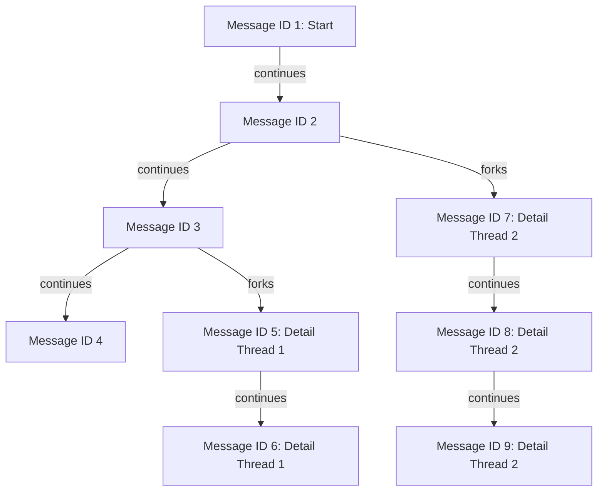

## gpt2099 [](https://discord.com/invite/YNbScHBHrh)

gpt2099 helps you interact with LLM using Nushell. It has the following goals:

- Help users interact with LLMs in a natural and intuitive Nushell way ([Nushell](https://www.nushell.sh) way of thinking)
- Highlight the value of [xs (cross-stream)](https://github.com/cablehead/xs) as a local event source database
- Demonstrate how you can create CLI tools that are both interactive and composable using Nushell

If we are successful, we will usher in a new wave of AI innovation in Nushell. We will show what is possible when you create a collection of standalone, primitive AI tools and give users the ability to compose compound AI pipelines.

Here is an example of what we are attempting to accomplish. This page will help you turn the following pseudo-code pipeline into a functioning example.

```nu
collect documents to discuss | inject system prompt | inject RAG results | inject episodic memory | call llm | analyze results
```

## Prerequisites

The purpose of this section is to ensure you have everything installed to successfully engage LLMs from Nushell.

- Install [Nushell](https://www.nushell.sh)
- Install [xs (cross-stream)](https://cablehead.github.io/xs/getting-started/installation/) 
- Git clone the following repositories locally:
  - This repository - needed to use [gpt2099.nu](https://github.com/cablehead/gpt2099.nu/blob/main/gpt2099.nu)
  - [xs (cross-stream)](https://github.com/cablehead/xs/) - needed to use [xs.nu](https://github.com/cablehead/xs/blob/main/xs.nu)

## xs (cross stream) Summary

Before we get started, you should now a little about xs (cross stream), a local-first event source database.

- What is it: `xs` helps you aggregate the many artifacts you collect when engaging one or more LLMs.
- Why is it required: there is little you can do with an LLM without employing some sort of memory. `xs` helps you keep track of all the documents, prompts, RAG results, previous conversations, ... associated with generating value with LLM interactions.

**Action:** launch a local `xs` server. You can launch it anywhere. Just remember where you put it. You will need to reference it later.

```bash
cd ~
xs serve ./store
```

## Getting Started

The purpose of this section is to make your first call to an LLM. Launch Nushell `nu` and paste the following commands:

```nu
cd ~
use /home/<your-home>/code/xs/xs.nu *
use /home/<your-home>/code/gpt2099.nu/gpt2099.nu
$env.GPT2099_PROVIDER = {name: openai, model: "gpt-4o"}
$env.XS_ADDR = "/home/<your-home>/store" #same as above
$env.OPENAI_API_KEY = "sk-proj-..."
"lets talk about cats" | gpt2099 new
"what is your favorite" | gpt2099 resume
```

Where:

- We assume you cloned the above repositories into ~/code/
- We load both the xs.nu and gpt2099.nu Nushell modules
- We set environment variables needed to quickly connect to your LLM account
- We pass in a new conversation prompt setting the context about 'cats'
- We continue the conversation by asking about a 'favorite' without mentioning 'cats' to confirm we are in fact engaged in a contextual conversation

## Quick Results

The purpose of this section is to help you make LLM results available at your fingertips - no mouse needed!!

First, add the above `use` and `$env` commands to your [Nushell config](https://www.nushell.sh/book/configuration.html#quickstart) so these values are set every time you launch Nushell.

Second, determine your operating system's keystroke to open a terminal. On Linux, it is often `super+t`. 

Now, you can access the wisdom of an LLM from anywhere on your computer with a simple keystroke and immediately asking any question you wish.

Here is an example:

```nu
"anthropomorphize" | gpt2099 new
To anthropomorphize is to attribute human characteristics, emotions, behaviors, or intentions to non-human entities, such as:

1. Animals
- "The dog felt guilty about chewing the shoe"
- "The cat plotted revenge"

2. Objects
- "The car refused to start today"
- "The computer is being stubborn"
...
```

To make things even easier, create an alias in your [Nushell config](https://www.nushell.sh/book/configuration.html#quickstart):

```nu
alias llm = gpt2099 new
alias llm. = gpt2099 resume
```

How, you can quick ask:

```nu
"chuck steak" | llm # original question
"best cook method" | llm. # followup question
```

## Commands

The purpose of this section is to help you learn how to use gpt2099. Rather than repeat what is already available in code, we are going to help you learn by using.

To view all available commands, use Nushell's auto complete feature by typing in gpt2099 and pressing tab. Here is an example:

```nu
~> gpt2099 <tab>
gpt2099 call
gpt2099 ensure-api-key
gpt2099 ensure-provider
gpt2099 id-to-messages
gpt2099 new
gpt2099 prep
gpt2099 read-input
gpt2099 resume
gpt2099 select-provider
gpt2099 system
```

To learn about any one subcommand, call the -h option for help.

```nu
~> gpt2099 new -h
Usage:
  > new

Flags:
  -h, --help: Display the help message for this command

Input/output types:
  ╭───┬───────┬────────╮
  │ # │ input │ output │
  ├───┼───────┼────────┤
  │ 0 │ any   │ any    │
  ╰───┴───────┴────────╯
```

If at any time you feel the help is incomplete, either post to the [](https://discord.com/invite/YNbScHBHrh) or create a pull request. We welcome all feedback.

## Usage Modes

The purpose of this section is to help you better understand how to use gpt2099. 

Here are the modes:

- Pipeline/script (no tty)
- Interactive (tty)

### Pipeline/Script

In previous examples, we demonstrated the following non-interactive command. The below example could be part of a bigger pipeline or script.

```nu
"lets talk about cats" | gpt2099 new
```

### Interactive

One of the goals of the project is to demonstrate how you can create CLI tools that are interactive using Nushell. Rather than simply have a command fail, we would like to prompt the user for more information if and when possible.

Example interaction where the system prompts you if you did not supply one:

```nu
~> gpt2099 new
prompt: lets talk about cats
Absolutely, I'd love to talk about cats! Cats are fascinating creatures.
```

Example interaction where the system prompts you for an LLM API key if not already set as part of the `select-provider` subcommand:

https://github.com/user-attachments/assets/dd99e920-480c-4d47-ba52-6c62217d1194

## xs (cross-stream) Details

The purpose of the section is to help you use your local `xs` instance specifically in the context of gpt2099. We will use these details in the below gpt2099 use cases.

To view a list of current conversations/events, use the `xs` command `.cat`:

```nu
.cat
```

To view the contents of any one conversation/event, use the `xs` command `.get` to get the hash and the `xs` command `.cas` to print the message from the hash:

```nu
.get <id> | .cas
```

To print all messages up to an event id, use the `gpt2099` command `id-to-messages`:

```nu
gpt2099 id-to-messages <id>
```

## Conversation Forking Use Case

The purpose of this section is to illustrate how easy it is to fork a conversation using `xs` and `gpt2099`. Here is an example:

```nu
"start a conversation about something" | gpt2099 new
"continue the converation" | gpt2099 resume
"let's pretent the last result from the llm was not good" | gpt2099 resume
.cat # to see all messages
gpt2099 id-to-messages <id> # to confirm we get the id of the last known desired conversation
gpt2099 resume --id <id> # using any previous good id as the point to fork the conversation
```

Here is a visual to help demonstrate the use case:



We feel it is important to note that forking a conversation is not easy to reason about when you are writing an application. Creating a good user experience with proper flexibility is difficult and code intensive.

However, this use case becomes almost trivial when you think about it in terms of tools (nushell + xs) as demonstrated above.

## Document Aggregation Use Case

The purpose of this section is to illustrate how you can aggregate documents and artifacts for LLM analysis.


## FAQ

- Why does the name include 2099? What else would you call the future?
- What is a message?
- What is a conversation?
- What is an event?

## Original intro

https://github.com/user-attachments/assets/4c74e5e6-c413-402b-8283-45a3a149bce5

