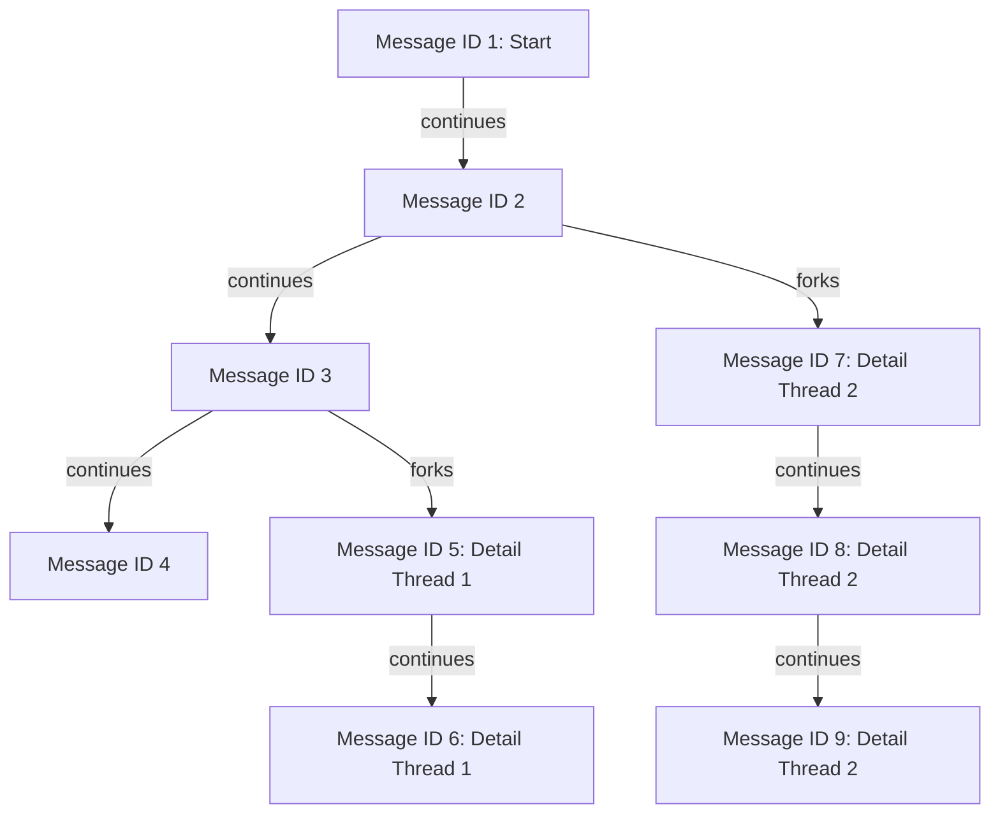

## gpt2099 

[Nushell](https://www.nushell.sh) + [cross-stream](https://github.com/cablehead/xs) + llms

## Requirements

- [Nushell](https://www.nushell.sh)
- Install [cross-stream](https://cablehead.github.io/xs/getting-started/installation/) and get familar with the [basics](https://cablehead.github.io/xs/getting-started/first-stream/)

## Getting started

- Clone this repository
- `use gpt2099.nu *`
- start a cross-stream store in a dedicated window: `xs serve ./store`

- In the same directory, select a provider: `select-provider`

https://github.com/user-attachments/assets/dd99e920-480c-4d47-ba52-6c62217d1194

- Start a chat thread: `"hello" | new`
- Continue the thread `resume`

## Original intro

https://github.com/user-attachments/assets/4c74e5e6-c413-402b-8283-45a3a149bce5

## Threaded conversations

