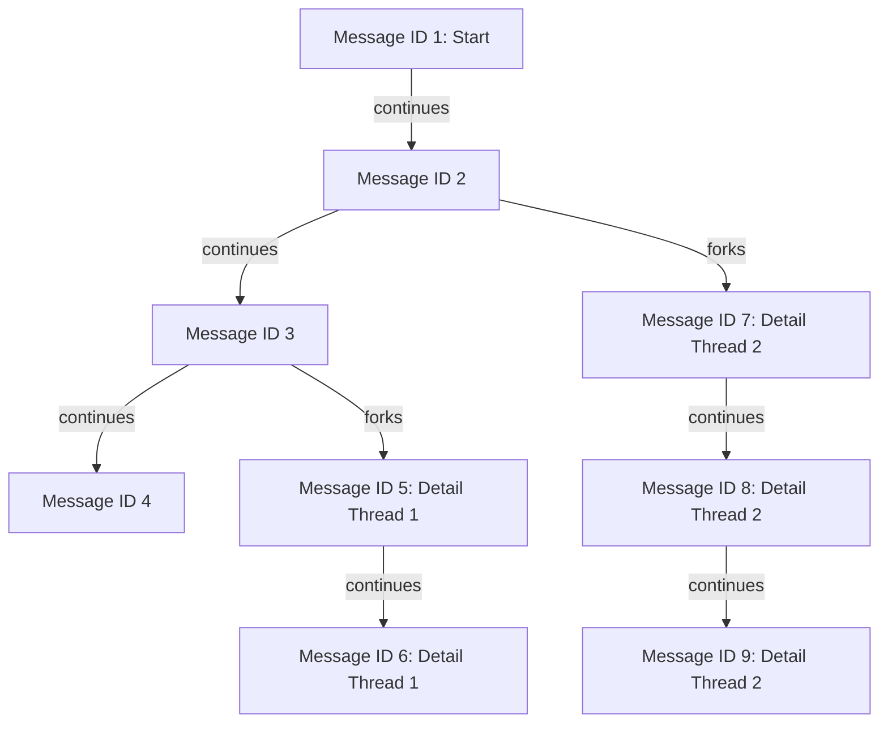

## gpt2099

Nushell + cross-stream + llms

https://github.com/user-attachments/assets/4c74e5e6-c413-402b-8283-45a3a149bce5

```mermaid
flowchart TD
    A[Message ID 1: Start] -->|continues| B[Message ID 2]
    B -->|continues| C[Message ID 3]
    C -->|continues| D[Message ID 4]

    C -->|forks| E[Message ID 5: Detail Thread 1]
    E -->|continues| F[Message ID 6: Detail Thread 1]

    B -->|forks| G[Message ID 7: Detail Thread 2]
    G -->|continues| H[Message ID 8: Detail Thread 2]
    H -->|continues| I[Message ID 9: Detail Thread 2]
```
