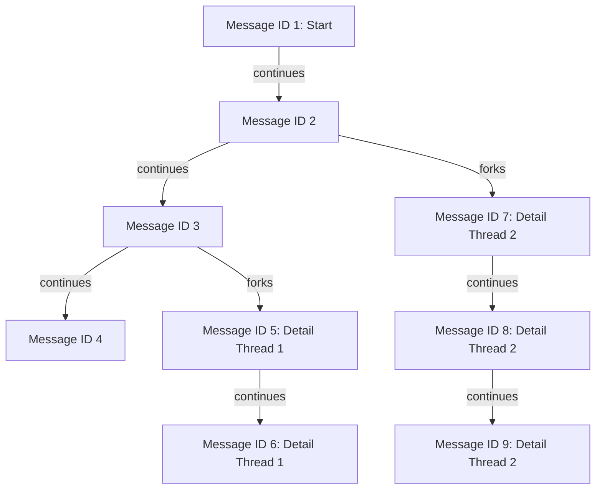

## gpt2099 [](https://discord.com/invite/YNbScHBHrh)

GPT2099 helps you interact with LLM using Nushell. It has the following goals:

- Help users interact with LLMs in a natural and intuitive Nushell way ([Nushell](https://www.nushell.sh) way of thinking)
- Highlight the value of [xs (cross-stream)](https://github.com/cablehead/xs) as a local event source database

If we are successful, we will usher in a new wave of AI innovation in Nushell. We will show what is possible when you create a collection of standalone, primitive AI tools and give users the ability to compose compound AI pipelines.

Here is an example of what we are attempting to accomplish. This page will help you turn the following pseudo-code pipeline into a functioning example.

```nu
collect documents to discuss | inject system prompt | inject RAG results | inject episodic memory | call llm | analyze results
```

## Prerequisites

The purpose of this section is to ensure you have everything installed to successfully engage LLMs from Nushell.

- Install [Nushell](https://www.nushell.sh)
- Install [xs (cross-stream)](https://cablehead.github.io/xs/getting-started/installation/) 
- Git clone the following repositories locally:
  - This repository - needed to use [gpt2099.nu](https://github.com/cablehead/gpt2099.nu/blob/main/gpt2099.nu)
  - [xs (cross-stream)](https://github.com/cablehead/xs/) - needed to use [xs.nu](https://github.com/cablehead/xs/blob/main/xs.nu)

## xs (cross stream)

Before we get started, you should now a little about xs (cross stream), a local-first event source database.

- What is it: `xs` helps you aggregate the many artifacts you collect when engaging one or more LLMs.
- Why is it required: there is little you can do with an LLM without employing some sort of memory. `xs` helps you keep track of all the documents, prompts, RAG results, previews conversations, ... associated with generating value with LLM interactions.

**Action:** launch a local `xs` server. You can launch it anywhere. Just remember where you put it. You will need to reference it later.

```bash
cd ~
xs serve ./store
```

## Getting started

The purpose of this section is to make your first call to an LLM. Launch Nushell `nu` and paste the following commands:

```nu
cd ~
use /home/<your-home>/code/xs/xs.nu *
use /home/<your-home>/code/gpt2099.nu/gpt2099.nu
$env.GPT2099_PROVIDER = {name: openai, model: "gpt-4o"}
$env.XS_ADDR = "/home/<your-home>/store" #same as above
$env.OPENAI_API_KEY = "sk-proj-..."
"lets talk about cats" | gpt2099 new
"what is your favorite" | gpt2099 resume
```

Where:

- We assume you cloned the above repositories into ~/code/
- We load both the xs.nu and gpt2099.nu Nushell modules
- We set environment variables needed to quickly connect to your LLM account
- We pass in a new conversation prompt setting the context about 'cats'
- We continue the conversation by asking about a 'favorite' without mentioning 'cats' to confirm we are in fact engaged in a contextual conversation

to be continued...
----


- There's also a convenience to help pick from the available providers: `select-provider`

https://github.com/user-attachments/assets/dd99e920-480c-4d47-ba52-6c62217d1194

- Start a chat thread: `"hello" | new`
- Continue the thread `resume`

## Original intro

https://github.com/user-attachments/assets/4c74e5e6-c413-402b-8283-45a3a149bce5

## Threaded conversations


